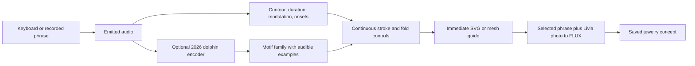

# Cetacean music drawing and sound maps with 2026 models

Investigated on 7 October 2026. The strongest first experiments are a playable
dolphin whistle instrument, humpback accompaniment, and a map that opens
annotated recordings. Reconstruction of images supposedly communicated by
dolphins is not supported by the evidence reviewed here.

**Assumed:** whales and dolphins, recorded audio and a human-operated art demo,
endpoints of audible musical correspondence, controllable drawing and traceable
sound annotations. If wrong, conclusions may change. Implementation candidates
below have 2026 model releases; older biological studies are used to assess the
claims. These are research proposals, not locally benchmarked pipelines.

## Read this investigation together

- [Existing projects and precedents](cetacean-art-precedents.md): artwork,
  music, animal interfaces and the source of the dolphin-image claim.
- [2026 models and evidence](2026-art-models.md): release dates, actual inputs,
  explanatory paper figures, limits, evidence ledger and search log.
- [CHAT in detail](chat-sound-interface.md): hardware pictures, the shared-sound
  interaction, a whistle-controlled vehicle prototype and transfer to drawing.
- [Earlier brainstorm](artistic-experiments.md): the implemented CLAP/FLUX
  experiments and what their outputs taught us.
- [Livia's practice](livia-experiment-brief.md) and [world-map guide](world-map.md):
  the material and data context for the proposals below.

The model audit distinguishes a new trained release from a new paper about old
checkpoints. It excludes WhAM's 2025 release from the strict shortlist and does
not rely on an unverified DolphinGemma release. There is no verified available
2026 dolphin waveform generator in this investigation; the keyboard demo can
start from recordings and explicit contour synthesis.

## 1 Music that follows whale or dolphin sound

**Implemented 7 October 2026:** [follow the phrase](follow-the-phrase.md). ACE-Step
lego accompaniment and raw-recording conditioning did not follow the phrases. A cover
of the measured guide followed timing modestly (z ≥ 3 for 3–4 of 6 sources) and moved
toward a perturbed guide in 6 of 6.

**Verdict:** a useful experiment with available 2026 music models; success on
cetacean input is untested. Whale sampling and performance already exist in
[Rothenberg's work](cetacean-art-precedents.md#whale-music-and-live-visuals).
The new question is whether an arranger audibly follows a particular animal
phrase, and whether we can show how.

Proposed chain: real humpback phrase → optional DoLittle continuation → musical
guide → ACE-Step base arrangement or Stable Audio 3 transformation. Keep the
original whale track available independently in the final mix.

DoLittle's audited 2026 release is a **humpback** model. It is not a replacement
sperm-whale model. For sperm whales, start with real recordings and annotated
coda timing; WhAM's 2025 public release does not qualify under the restriction.
A verified 2026 species-specific sperm-whale or dolphin waveform generator was
not identified. Generation is optional: real animal audio is already an input
for the music experiment.

Test three conditions with the same musical direction: direct animal audio;
a guide instrument rendered from measured pitch contours and event timing;
and a prompt-only baseline. The guide establishes exactly which acoustic
properties become musical decisions. It can transpose dolphin contours into a
human instrument register while preserving their relative shape and duration.

ACE-Step's global `reference_audio` averages time; `src_audio` and base-model
arrangement tasks are more relevant to timing and melody. Stable Audio 3 offers
another source-audio route. The [interface audit](2026-art-models.md#music-model-interfaces)
documents their different controls and sources. Neither has demonstrated
cetacean-specific success in the evidence reviewed here.

Judge fit with aligned phrase boundaries, event timing and contour similarity,
plus listening to isolated animal and accompaniment tracks. Swap or shuffle
the source while holding the prompt and seed fixed: music that remains
indistinguishable is weak evidence that the animal audio controls it.

### First comparison and deliverable

Use a small selection of contrasting phrases with verified audio and event
timing. Start with a short whistle, a sustained humpback phrase and a sperm-whale
coda; test each species separately rather than assuming one model transfers.

| Condition | Input to the music model | Question |
|---|---|---|
| Prompt-only | Same musical direction, no source audio | What does the model invent unaided? |
| Raw-source | Selected animal recording | Does conditioning survive domain mismatch? |
| Measured guide | Rendered F0 contour or onset pattern in a declared instrument/register | Does an explicit musical structure improve correspondence? |
| Perturbed guide | Reordered events or changed contour with otherwise fixed settings | Does the output follow the change? |

Keep separate files for original animal audio, guide, generated music and mix.
Show aligned waveforms/event markers and listening buttons for each. Record
source/model sample rates, register shifts, gains, seeds and source-audio strength.
For sustained whistles compare relative pitch shape after the declared
transposition; for codas compare onset intervals. A global style score alone
does not establish either relationship.

**Stop condition:** if source swaps and timing perturbations do not produce
consistent musical changes, report the result as atmosphere inspired by sound.
Try the guide route or a deterministic instrument response before claiming
source-following accompaniment. Do not infer whale preference from human
listeners finding the mix pleasing.

## 2 Dolphins drawing through sound and a human keyboard demo

> **Status, 7 October 2026: the human keyboard and contour brush are implemented**
> (`art brush`). See the [sound-brush report](sound-brush.md).
> - Designed contours select grow, branch, fold or open, and click trains lay beads.
> - The replayed WAV reproduces the identical stroke hash.
> - Single acoustic changes have measured, designed effects.
> - The OpenWhistle layer was weaker than measured contours as a command recognizer.
> - The FLUX concept stage is not yet run.

**Verdict:** the human instrument can be prototyped now. Dolphin-operated drawing
is a separate research hypothesis. [CHAT](cetacean-art-precedents.md#chat-and-underwater-keyboards)
provides an acoustic interaction precedent, and
[brush painting](cetacean-art-precedents.md#dolphins-painting-with-wyland)
provides a collaboration precedent; neither establishes vocal drawing.
The [CHAT report](chat-sound-interface.md) also covers the 2025 sound-controlled
vehicle prototype and distinguishes prototype operation from learned animal
control.

A feasible human demo is MIDI keyboard → whistle sample/contour synthesizer →
sound analysis → immediate drawing. Keys select contour families; key duration
controls phrase duration; pitch bend changes contour; velocity controls the
human performance dynamics. Label recordings, transformed recordings and
synthetic whistles separately. OpenWhistle supplies representations, not a
decoder that turns keyboard notes into dolphin vocalizations.

Proposed drawing controls: frequency slope changes turning, phrase duration
changes stroke length, modulation changes curl, click density changes texture,
and silence lifts the brush. Learn additional motif families from whistle
embeddings, with representative playable examples. In Livia's visual language,
these can control folds, branching, crests and openings. Use a fast vector or
mesh preview during performance; render selected designs through FLUX after a
phrase. Analyze the emitted waveform rather than drawing directly from MIDI,
so the same audio can reproduce the same drawing without the keyboard.

This is the proposed explanatory schema. The continuous guide makes each
measured change inspectable; the image render is a subsequent concept stage.

Animal participation would require a learned sound-to-effect relationship and
perceivable immediate feedback. Keyboard experiments showed spontaneous
mimicry of artificial whistles and some context-appropriate use by two aquarium
dolphins, but did not establish intentional drawing:
[Reiss and McCowan, DOI 10.1037/0735-7036.107.3.301](https://pubmed.ncbi.nlm.nih.gov/8375147/).
CHAT's 2013–2016 field sessions found imitation without functional label use:
[Herzing et al. 2024, DOI 10.26451/abc.11.02.02.2024](https://doi.org/10.26451/abc.11.02.02.2024).
The 2026 voluntary-vocal-control study reports one trained Pacific white-sided
dolphin producing two call types on cue; this supports a limited control premise,
not artistic intent ([PMID 42772609](https://pubmed.ncbi.nlm.nih.gov/42772609/)).
Contingent versus delayed/shuffled visual feedback would be a useful test of
whether an animal actually learns control. This needs a research partner and
an appropriate display/hydrophone setup before becoming an animal experiment.

### A keyboard with a visible correspondence

| Human control | Audible action | Measured drawing control |
|---|---|---|
| Key selection | Choose a recorded whistle or explicit synthesized contour | Select a phrase/motif family |
| Hold duration | Extend or repeat a defined phrase, with the transformation labelled | Stroke duration and length |
| Pitch bend | Shift or reshape the contour within declared limits | Turning and curvature from measured slope |
| Velocity | Change playback dynamics | Stroke width after controlled gain normalization |
| Rest/release | Stop the source sound | Lift the brush and end the phrase |

Amplitude is a performance control here, not an inferred emotion or intrinsic
animal attribute. For archived recordings, gain and distance can dominate it.
Display both the original high-rate sound and any audible transposition. A
pitch shift should preserve the chosen timing unless time stretching is
explicitly part of the performance.

Build the first brush from contours/onsets, then add a separately switchable
OpenWhistle embedding or learned-unit layer. The learned layer can choose motif
families; the explicit layer gives continuous control. Show representative
sounds beside each learned family. The
[paper figures and reproduction checks](2026-art-models.md#dolphin-representations-and-explanatory-visuals)
explain what the learned representation currently supports.

For Livia, apply the stroke to a folded silver setting, growth around porous
opal or open-cell arrangement. Offer a source photograph, the audio/contour,
the live guide and the final rendered concept. These are concept images; a
wearable object still needs geometric and material design.

**First artifact:** a saved performance containing audio, extracted controls,
stroke JSON/SVG and a few photo-guided concept renders. Replaying the sound
should reproduce the guide, even without MIDI. Hold the visual seed fixed and
change only one acoustic feature to show a substantial, legible effect. Measure
actual input-to-stroke latency before describing it as a live instrument.
*Done except the concept renders.* Live MIDI is phrase-level: 0.3–0.5 s after a 0.8 s
phrase gap, tested with a scripted virtual port rather than a performer.
[Results](sound-brush.md#results).

### What would count as animal control?

A partnered study would begin with a few effects, not an unrestricted generative
canvas. Establish that the participant can perceive the feedback and distinguish
the effects. Then compare immediate sound-contingent feedback with delayed or
yoked feedback, while recording researcher cues and choices. Test learned
selection of an effect and whether that selection changes when the mapping
changes. Successful mimicry alone would not show use of the effect.

The scope of this investigation is the recorded-audio/human demo. Animal
participation needs a separate study design and partner; no contact or live
animal experiment has been initiated.

## 3 Images in dolphin sound

**Verdict:** no validated decoder of deliberately communicated dolphin images
was identified. There are three different questions: recognizing objects from
echoes, reconstructing a target from a controlled sonar measurement, and
transmitting a stored mental image. Evidence for the first does not answer the
third.

Object recognition through echoes is supported. An experiment also showed a
dolphin matching objects after listening to another dolphin inspect them:
[Xitco and Roitblat, DOI 10.3758/BF03199007](https://link.springer.com/article/10.3758/BF03199007).
That is access to reflected acoustic information about an object. It does not
show a dolphin encoding and transmitting a stored visual image.

The likely source of the stronger image claim is the 2016 CymaScope study,
[DOI 10.4172/2155-9910.1000202](https://www.speakdolphin.com/pressrelease/Speak-Dolphin_Phenomenon-discovered-while-imaging-dolphin-echolocation-sounds-2155-9910-1000202.pdf).
It describes object-like patterns in a driven water cell. Its own methods report
slowing/equalizing the signal, uncertain timing, and substantial work selecting
frames. It does not supply a validated general image decoder. No replicated
2026 model for recovering communicated dolphin images was identified in the
searches below.

A defensible alternative is a controlled echo-to-shape experiment with known
targets, emitted pulses, returning echoes and sensor geometry. The reviewed
2026 [BEML-sonar study, DOI 10.1038/s41598-026-56574-7](https://www.nature.com/articles/s41598-026-56574-7)
concerns bio-inspired sonar detection/navigation, not dolphin mental-image
reconstruction. Ordinary whistle recordings lack the paired target/echo data
needed to validate such a decoder. Generating an attractive image from a
whistle would remain an artistic association.

### A reconstruction experiment that could be evaluated

Collect paired records with known target shape/material, outgoing pulse,
returning echo, sensor positions, range, angle and acquisition conditions. Start
with simple shapes and a controlled acoustic system. Distinguish classification
(which known target?) from reconstruction (recover its geometry?). Hold out
entire targets and acquisition sessions, not just nearby windows from a shared
recording.

Compare a physical/time-of-flight baseline, an acoustic encoder with a supervised
target head, and any proposed image renderer. Evaluate shape error or target
recognition against ground truth. A renderer producing plausible dolphins,
fish or objects from a generic audio embedding does not solve the inverse
problem. The input must actually contain the relevant returned echoes.

**Dependency and stop condition:** the existing whistle and coda collections are
not paired echo/shape data. Do not train or present an image decoder from them.
First locate or create the required measurements. A visual explanation of
echolocation or a declared artistic sound-to-image mapping remains feasible
without making a reconstruction claim.

## 4 Connect the map to audio and annotations

**Verdict:** feasible as data linking and interaction work, without requiring a
new model. [Pattern Radio](cetacean-art-precedents.md#pattern-radio-whale-songs)
is a useful listening precedent; [Tay Fins](cetacean-art-precedents.md#tay-fins)
shows how a material object can connect to local animals and recordings.

The [existing map](maps/world-map.html) and [guide](world-map.md) provide 44
species and 172 location entries. Its points represent recorders, archive
locations or regional anchors, with different precision. The saved points are
aggregates and need a recording/event index to open individual sounds.

Proposed navigation: map selection → recording list → player and spectrogram →
annotation timeline → original/generated drawing or accompaniment. Selecting
a timeline event highlights its map location and an acoustic-similarity view;
selecting a similar sound opens its source recording.

Join real audio through recording IDs and deployment IDs. An event record
should contain `event_id`, `recording_id`, `deployment_id`, `start_s`, `end_s`,
`species`, `label`, `annotation_origin`, `confidence`, `model_revision`,
`audio_path`, `lat`, `lon`, and `coordinate_precision`. Human annotations and
model predictions need distinct origins. Generated assets should retain parent
event IDs, model versions, seeds and transformations.

Keep geography and acoustic similarity as linked views. OpenWhistle embeddings
can support a dolphin-whistle similarity view after evaluation; a UMAP position
is not a geographical position or proof of a dialect. DCLDE has an existing
deployment/annotation join; DSWP lacks coda-level GPS, while the OpenWhistle map
point is a regional anchor. Preserve those limits. Compare sites only with
recording-condition controls: differences may reflect sensors and background
noise rather than animals.

### First join and annotation schema

Start with a DCLDE deployment/annotation subset already audited in this
repository. Join its published times and deployment metadata to a small number
of accessible audio excerpts. Keep public metadata records useful even when
the audio is not yet downloaded. The
[DCLDE guide](dclde-2027.md) documents availability; the
[map audit](world-map.md) documents coordinate precision.

| Entity | Required relationship | Important distinction |
|---|---|---|
| Deployment/location | Stable ID and source coordinates or regional anchor | Recorder position versus localized animal |
| Recording | Dataset/provider ID, deployment ID, audio asset and time basis | Whole-file time versus excerpt-relative time |
| Event/annotation | Recording ID, interval, label and annotation origin | Human label versus model prediction |
| Representation | Event ID, model revision and preprocessing | Embedding similarity versus biological interpretation |
| Generated asset | Parent event IDs, mapping version, model, seed and transformations | Recording versus synthesis or visual interpretation |

Add UTC timestamps where the source supplies an absolute time. Keep `start_s`
and `end_s` as offsets into the identified recording. Preserve any crop offset
so playback and annotations do not drift. Unknown coordinates remain unknown;
regional points need an explicit precision/anchor label.

**First artifact:** a location opens an event list, a playable excerpt and an
annotated spectrogram. Selecting a call highlights its interval and any derived
stroke, musical answer or nearest sounds. A similarity selection returns to
the recording and its location. Include a downloadable event manifest.

**Acceptance:** each event round-trips to its exact audio interval and source
annotation; an unavailable clip has an honest availability state. Playback
must be audibly checked, especially for high-frequency inputs. The UI should
offer a separately labelled audible transformation where needed. This extends
the present map; it is not functionality already implemented by this report.

## 5 Additional 2026 directions

- **A learned brush vocabulary.** Dolph2Vec reports partial codebook
  specialization and clustering by signature-whistle categories. Test whether
  recurring units can drive stable motifs with audible examples. The paper
  omits behavior/environment and does not identify words or intentions.
  [Analysis](https://arxiv.org/html/2606.12503v1#S4.SS5).
- **A musical answer with visible provenance.** Generate a humpback continuation,
  render its pitch/timing as a guide instrument, and have ACE-Step arrange an
  answer. Display which phrases came from the recording, generator and musician.
- **A short audiovisual performance.** The September/October 2026 preprint
  [Soundwich, arXiv:2610.00691](https://arxiv.org/abs/2610.00691) adds timed,
  independently editable audio stems to joint audio/video generation.
  [Code](https://github.com/CodyNing/Soundwich) is available. A visual installation
  could use this structure for separate instrument, ambient and synthetic
  animal-like tracks; cetacean fidelity and conditioning are unproven. It is a
  stretch experiment, not the live drawing engine.

### Compare representations as an explanatory artwork

Play one whistle while displaying its measured contour, learned nearest
neighbors and proposed motif. Let the visitor change a single property and see
which representations change. Compare contour-only and embedding-driven strokes
with a shuffled-assignment baseline. This turns explanation itself into an
interactive work and reveals when a learned representation responds to noise
or recording conditions rather than the intended phrase.

### A sound atlas becomes an inhabited piece

Connect the map's phrase groups to Livia's material vocabulary, then enlarge a
selected setting into a Livistone space. Visitors can move among source events
and hear the musical response. Keep the identity, place and material choice
traceable. Use a 2026 visual model for saved concepts; require explicit guides
for changes to folds and openings. Location or sound similarity alone should
not invent ecological or cultural meaning.

### What 2026 can add to the earlier work

The reviewed precedents already used audio analysis, machine learning and
responsive imagery. The opportunity is a species-trained representation, a
current audio-conditioned arranger, editable timed audiovisual layers and a
replayable explanation of their connection. These are candidate advances in
our demo; their advantage over the earlier artworks has not been demonstrated.
The [model report](2026-art-models.md) separates available tools from research
results and unreleased checkpoints.

## Implementation sequence and first artifacts

| Order | Experiment | First saved artifact | Decision before expanding |
|---|---|---|---|
| 1 | Human whistle keyboard and sound brush | Playable sound, controls, SVG and source-photo concept sheet | Replay is reproducible; individual controls visibly alter the stroke. **Met on 7 Oct 2026, except the concept sheet** ([report](sound-brush.md)) |
| 2 | Music follows the phrase | Animal/guide/generated/mix stems and aligned event display | Source swaps and perturbations change the music in the intended way |
| 3 | Map-linked listening | Small event manifest and location/player/annotation panel | Event offsets, IDs and coordinate precision survive round-trip inspection |
| 4 | Learned motif vocabulary | Paper-style feature plots and audible motif examples | Exact checkpoint compatibility and stability beat random assignment |
| 5 | Saved audiovisual performance | Short video and separately editable audio stems | Runtime and conditioning are adequate for the chosen installation |
| Separate research | Controlled echo-to-shape inference | Paired-data audit and held-out target benchmark | Required echo/target data exists; no communicated-image claim |

Reuse `uv` for managed dependencies, `pathlib.Path` for paths and Typer for
commands when implementing. Add isolated dependency groups where model stacks
conflict; pin tested revisions in run manifests. This report itself does not install
dependencies or add CLI commands. The later [sound brush](sound-brush.md) adds the
`art brush` commands and a `midi` dependency group.

Use the existing `data/input`, `data/interim` and `data/output` structure.
Inputs hold source assets and acquisition manifests; interim holds extracted
contours, tokens, embeddings and event joins; output holds generated audio,
SVG/meshes, rendered images, galleries and their manifests. Generated outputs
remain Git-ignored. Commit small schemas, mapping definitions and selected
metadata audits under `resources/`, plus the explanation under `docs/`.

Every gallery should follow **Input → Schema → Output**. Put original photos
and independently playable source sound in Input. Put the mapping, contours,
parameters and model/task choice in Schema. Put strokes, concept images and
generated music in Output. Keep generated music and original animal sound
individually playable so visitors can judge the relationship.

The first implementation should be the whistle keyboard and sound brush,
followed by the music comparison. Both can produce useful human-operated art
without waiting for a dolphin generator or making a biological decoding claim.

## Remaining research checks

1. Reproduce ACE-Step's source-audio arrangement task with a short humpback guide.
2. Compare Stable Audio 3 against the same guide and direct animal audio.
3. Audit OpenWhistle/Dolph2Vec checkpoint and quantizer compatibility.
4. Inspect candidate paired pulse/echo/target data before planning sonar inversion.
5. Evaluate Soundwich's example assets and runtime before a video experiment.

The [model report](2026-art-models.md#evidence-ledger) records candidate claims,
contrary findings, verification routes and the search log. The
[precedent report](cetacean-art-precedents.md) explains what already exists.
