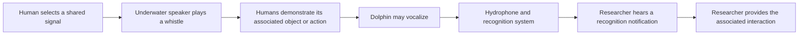

# CHAT: a shared sound interface and its relevance to drawing

Investigated **7 October 2026**. CHAT is a concrete precedent for associating
sounds with actions. Its established purpose is a human–dolphin interaction
interface; learning to control a drawing remains our proposed extension.

Read together: [existing projects](cetacean-art-precedents.md) ·
[drawing experiment](2026-art-ideas.md#2-dolphins-drawing-through-sound-and-a-human-keyboard-demo) ·
[2026 model audit](2026-art-models.md) ·
[**implemented sound brush and its results**](sound-brush.md).

Videos:
- [Georgia Tech College of Computing, "Exploring Wild Dolphin Communication with C.H.A.T."](https://www.youtube.com/watch?v=YhopeQKbpZA): the explanatory animation, embedded in [Georgia Tech's article](https://www.cc.gatech.edu/news/video-illustrates-interactive-tech-created-help-understand-dolphin-communication).
- [Google, "DolphinGemma: How Google AI is helping decode dolphin communication"](https://www.youtube.com/watch?v=T8GdEVVvXyE).
- [Dolphin CHAT Bot capstone demonstration, "Dolphin Capstone B18"](https://www.youtube.com/watch?v=kbzZdFaaAwk).

The first explains a designed interaction, the second presents a model, and the third
is linked by a prototype project. None of them is a demonstrated dolphin drawing
experiment.

## What CHAT is

CHAT is developed by Georgia Tech's Thad Starner and collaborators with Denise
Herzing's Wild Dolphin Project. The name has three published expansions:

- **Cetacean Hearing Augmentation Telemetry**: Google and Herzing et al. 2024.
- **Cetacean Hearing Augmented Telemetry**: Georgia Tech and Herzing 2016.
- **Cetacean Hearing and Telemetry**: the older WDP page.

WDP's fieldwork concerns wild Atlantic spotted dolphins in the Bahamas.
[Google's project account, coauthored by Herzing and Starner](https://blog.google/innovation-and-ai/products/dolphingemma/).
The earliest technical description is
[Kohlsdorf, Gilliland, Presti, Starner and Herzing, ISWC 2013, DOI 10.1145/2493988.2494346](https://doi.org/10.1145/2493988.2494346).

*Wild Dolphin Project photographs from the [CHAT research page](https://www.wilddolphinproject.org/our-research/chat-research/):
a chest-mounted unit on deck, and two researchers in the water with their units.*

The central idea is a small vocabulary of deliberately designed whistles
associated with enjoyable objects or interactions. Humans demonstrate a
whistle and its consequence. The system listens for a possible dolphin mimic
so a researcher can respond promptly.

Google's caption identifies **CHAT Senior, 2012** on the left and **CHAT Junior,
2025** on the right. This is historical hardware evidence, not a 2026 model
release. [Photo source](https://blog.google/innovation-and-ai/products/dolphingemma/).

## A concrete interaction

Imagine two researchers sharing a scarf. Each time they pass it, they play the
programmed scarf whistle. A dolphin can observe both the sound and the event.
If a similar incoming whistle is detected, the system notifies the researcher,
who can offer the scarf. The scientific question is whether the dolphin learns
to use that sound for the outcome.
[Georgia Tech's March 2024 explanation](https://www.cc.gatech.edu/news/video-illustrates-interactive-tech-created-help-understand-dolphin-communication)
and [its animation](https://www.youtube.com/watch?v=YhopeQKbpZA). The same article is
also published at [gatech.edu](https://www.gatech.edu/news/2024/03/12/video-illustrates-interactive-tech-created-help-understand-dolphin-communication),
which refused automated checks on 7 October 2026.

The diagram explains the proposed interaction loop; it is not evidence that
every step occurs successfully or that the dolphin understands the association.

## Hardware and recognition

| Component | Role in the interface |
|---|---|
| Keypad or wrist control | Lets the researcher select a programmed sound |
| Underwater speaker | Plays the shared whistle |
| Hydrophone and recorder | Captures incoming sounds and surrounding context |
| Onboard processing | Detects a possible matching whistle |
| Bone-conducting headphones | Gives the researcher a recognition notification |

Georgia Tech's 2024 account describes the evolution from a large chest-worn
computer to smaller chest/wrist units. Google's 2025 account describes Pixel
phone processing, including a Pixel 9 generation intended to combine template
matching with deep learning. These are project descriptions, not a downloaded
hardware/software package tested in this repository.
[Georgia Tech](https://www.gatech.edu/news/2024/03/12/video-illustrates-interactive-tech-created-help-understand-dolphin-communication),
[Google](https://blog.google/innovation-and-ai/products/dolphingemma/).

[Official hardware photograph](https://blog.google/innovation-and-ai/products/dolphingemma/).

Recognition and meaning are separate questions. A matching contour can indicate
a mimic, an incidental similar sound or a false detection. Functional use
requires contextual evidence that the sound selects the outcome. The older WDP
account explicitly reports a possible mimic without demonstrated contextual
use and notes that dolphins can shift whistles into a different frequency range.
[WDP's explanation of the evidence](https://www.wilddolphinproject.org/our-research/chat-research/).
In Herzing's words there: "although I heard a potential mimic, there was nothing to
indicate that this 'word' was used in context."

### What the field sessions found

The peer-reviewed outcome is
[Herzing, Pack, Delfour, Starner, Mason, Gilliland, Ramey and Kohlsdorf 2024, "Imitation of Computer-Generated Sounds by Wild Atlantic Spotted Dolphins (*Stenella frontalis*)", *Animal Behavior and Cognition* 11(2):136–166, DOI 10.26451/abc.11.02.02.2024](https://doi.org/10.26451/abc.11.02.02.2024).

- CHAT was used in 2013–2016 field sessions, mostly with juvenile females.
- The dolphins imitated the computer-generated whistles both immediately and with delay. The authors identified imitations from video/audio and from CHAT's own detections; many responses within seconds of playback were partial matches.
- The abstract concludes that the dolphins "did not show signs of a functional understanding of object labels."

This is the strongest available evidence on CHAT's animal side: **imitation was
demonstrated; functional use was not.** WDP's
[2025 field-season report](https://www.wilddolphinproject.org/field-season-trips-3-and-4/)
mentions Georgia Tech aboard "to continue field testing" CHAT, with "promising data".
It reports no learning result.

[Herzing's 2016 review of interfaces and keyboards, DOI 10.12966/abc.04.11.2016](https://doi.org/10.12966/abc.04.11.2016)
gives the wider context:

- 1960s acoustic systems produced mimicry and command following, but not functional or combinatorial understanding.
- Keyboard research later moved from acoustic to visual designs, partly for technical reasons.
- An acoustic trigger would be the most natural "touch" for a dolphin, because it needs no proximity to a device.
- Humans demonstrating to each other, as model and rival, helps.

The aquarium study by [Reiss and McCowan 1993, PMID 8375147](https://pubmed.ncbi.nlm.nih.gov/8375147/)
reports spontaneous mimicry, and also some productive, context-appropriate use of the
facsimiles by the two males that used the keyboard.

## A closer sound-to-action precedent: Dolphin CHAT Bot

Georgia Tech's Spring 2025 capstone page describes a whistle-controlled
underwater vehicle using a hydrophone, Pixel 9 processing and three thrusters.
Incoming vocalizations are intended to become movement commands. The page
describes controlled demonstrations and future live dolphin trials; it does
not establish that dolphins learned to steer it. Its wording is that the bot "will be
demonstrated in controlled aquatic environments to validate its responsiveness,
durability, and real-time processing capabilities, with future plans for oceanic
deployment and live dolphin trials."
[Project description](https://expo.gatech.edu/prod1/portal/portal.jsp?c=17462&g=413665329&id=417265676&p=413142918),
[linked demonstration video](https://www.youtube.com/watch?v=kbzZdFaaAwk).

This matters for our proposal: a whistle-to-action loop has already been designed
for something more direct than labelling a toy. A brush would replace vehicle
movement with a visible stroke or material gesture. Successful intentional
control remains the experimental question in either case.

## How DolphinGemma relates

DolphinGemma models natural sound sequences, whereas CHAT supplies an interaction
loop and deliberately shared signals. The 2025 announcement describes an
approximately 400M-parameter audio-in/audio-out model using SoundStream tokens,
trained on WDP recordings. The model could help recognize or predict acoustic
patterns; this does not itself assign meanings to them.

This figure is an early **2025 generation example** from the
[official announcement](https://blog.google/innovation-and-ai/products/dolphingemma/).
It does not establish a public 2026 checkpoint. The
[current model page](https://deepmind.google/models/gemma/dolphingemma/) says:
"DolphinGemma is currently in development. On release, it will be openly available."
The 2025 announcement planned an open release "this summer". On 7 October 2026 the
following searches found no public checkpoint:
- Hugging Face: dolphingemma, dolphin-gemma and Google-owned repositories.
- Kaggle Models: the dolphingemma search, `google/dolphingemma` and Google's model list.

Vertex Model Garden was not searched. See the
[model audit](2026-art-models.md#shortlist-and-release-evidence); the
[sound brush](sound-brush.md) uses OpenWhistle instead.

## Transfer to a sound-operated brush

The proposed art interface can have two layers. A small sound vocabulary selects
an effect—begin a stroke, branch, curl or lift the brush. Continuous properties
of that emitted sound adjust the effect: contour slope changes turning, duration
changes length and modulation changes curvature. These correspondences are
design choices we can display and change; they are not translations of natural
dolphin meanings.

| CHAT interaction element | Proposed art counterpart |
|---|---|
| Shared whistle | Audible brush gesture or motif selector |
| Offered play object | Immediate, perceivable stroke effect |
| Incoming-sound recognition | Measured contour/onsets plus optional learned representation |
| Researcher notification | Visible sound-to-control explanation and event log |
| Response after a signal | Repeatable drawing consequence |

Start with the human keyboard. Play recorded whistles or explicitly synthesized
contours, analyze the resulting waveform and apply the same mapping used on
animal recordings. Save audio and stroke data so replay is reproducible. For
Livia, the stroke can become a fold, branching setting or opening around a stone;
FLUX can render a selected concept after the phrase.

**Implemented on 7 October 2026** as `art brush` ([report](sound-brush.md)):

- **Vocabulary:** four designed contours select grow, branch, fold and open; click trains lay beads.
- **Recognition:** DTW in semitones, with rejection of falls, steady tones and natural whistles.
- **Continuous controls:** every tonal sound turns the stroke by 90° per octave and sets length and width.
- **Replay:** the identical WAV reproduced the identical stroke hash across a copy, a fresh process and a re-render.
- **Learned layer:** OpenWhistle embeddings were a weaker command layer than the measured contour.

The FLUX concept stage was not run.

Use a 2026 OpenWhistle representation as an optional learned layer, with a
contour-only comparison. Its training population differs from WDP's Atlantic
spotted dolphins and the artificial CHAT whistles; useful transfer needs
evaluation. A signature-whistle classification label is not a brush-command
label. We would need examples of our chosen commands, rejection of unrelated
sounds and checks under noise and pitch shifts.

## Evidence needed for a dolphin-operated version

1. Establish that the participant perceives the feedback and discriminates the
   available effects.
2. Compare immediate sound-contingent feedback with delayed or yoked feedback.
3. Test whether the participant selects effects and adapts when their mapping
   changes; record human cues and sound attribution.
4. Keep spontaneous/imitation events distinct from demonstrated use of an action.
5. Report the human contribution and measured controls alongside the result.

These are proposed evaluations, not results from CHAT or our repository. The
human demo can proceed independently; an animal study requires a separate
research partnership and setup. No contact with the projects has been initiated.

The [drawing report](2026-art-ideas.md#2-dolphins-drawing-through-sound-and-a-human-keyboard-demo)
details the first artifacts and comparisons. The
[precedent review](cetacean-art-precedents.md) connects CHAT to actual painting,
whale music and sound-driven installations.
