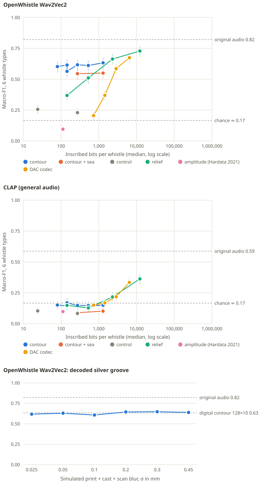

# Hardata II pilot: how much of a dolphin whistle can a silver band keep?

Run **7 October 2026** on this repository's assets. This is the minimal
experiment for [proposal P1](novel-experimental-plans.md#p1-hardata-ii-a-silver-inscription-that-keeps-the-whistle),
chosen as the first pilot in the [ranking](novel-projects.md#ranking).
Prior art is in the [prior-art report](novel-prior-art.md#p1-hardata-ii-a-silver-inscription-that-keeps-the-whistle);
novelty in the [assessment](novel-novelty-assessment.md#p1-hardata-ii-a-silver-inscription-that-keeps-the-whistle).

## Answer in brief

A 2026 dolphin-trained encoder still recognised the whistle type of **62% (macro-F1)**
of held-out whistles from a **272-bit** contour inscription, against **82%** for
the original recordings: 75% of the original performance from a pure tone that
follows the annotated pitch. Even **80 bits** kept 60%. An exploratory probe
trained on decoded tones raised the 272-bit contour to 75% macro-F1 (91% of
original), level with a codec using ten times the bits, so most of the loss was
domain shift rather than missing information. Reversing the contour or
flattening it to its mean pitch dropped performance to near chance, so the
encoder uses the contour's *shape*. Livia's 2021 *Hardata* rule, amplitude
only, scored below chance. At comparable budgets a spectrogram relief and a
neural codec kept far less; they caught up only at 2–12 kbit, more than a cast
ring band can hold at silver's 0.35 mm detail limit. A contour engraved as a
groove and read back after simulated casting blur kept the digital contour's
score, but that simulation omits the real failure modes of casting and
polishing.



*Upper panels: each point is one inscription condition on 420 test whistles,
with bootstrap 95% intervals; dashed lines mark original audio and chance.
Lower panel: contour read back from a simulated cast band. Hover titles work
when the SVG is opened directly; the playable gallery has the same charts and a
table view.*

## Why this experiment

Livia's *Hardata* (2021) engraved a sound-amplitude pattern on a cylinder and
noted that it had "no way of being played". Two questions follow. Which
inscription of a whistle could be played back and still be *that* whistle? And
does the answer survive the resolution of cast silver?

Biologically, signature-whistle identity is carried by the frequency contour:
dolphins recognised whistles with voice features removed
([Janik et al. 2006](https://doi.org/10.1073/pnas.0509918103)). The pilot does
**not** test dolphins. It tests whether the 2026 OpenWhistle encoder, trained on
114 hours of dolphin audio, separates whistle types from minimal inscriptions,
and which properties it relies on.

## Registered predictions

Written into [`experiments/inscription.py`](../experiments/inscription.py) before
the dataset was fetched (16:05 UTC). An 18-clip smoke test ran afterwards to
check the pipeline; the predictions were not changed. The first full run stamped
the registration in local time (UTC+3) labelled as UTC; the results file and code
were corrected.

| | Prediction | Outcome | Evidence (OpenWhistle listener, macro-F1) |
|---|---|---|---|
| H1 | A 32-point, 8-bit contour (272 bits) keeps ≥70% of original-audio macro-F1 | **Supported** | 0.617 vs 0.822 (75%) |
| H2 | Near 0.5 kbit, contour beats spectrogram relief and the 1-codebook DAC codec | **Supported** | vs relief 16×16×2 (528 bits): +0.107 [+0.051, +0.165]; vs DAC-1 (728 bits): +0.412 [+0.355, +0.467] |
| H3 | Amplitude only (Hardata 2021) stays within 10 points of chance | **Supported** | 0.096; chance ≈ 0.167 |
| H4 | Reversed contour and flat tone lose most of the contour's advantage | **Supported** | reversed 0.229, flat tone 0.256 vs contour 0.617 |
| H5 | Simulated groove keeps ≥90% of the digital contour at 0.1 mm blur, degrading smoothly | **Supported by its rule, but see limits** | 0.607 vs 0.633 (96%); 0.61–0.65 at every blur up to 0.45 mm |

Brackets are paired bootstrap 95% intervals on the same 420 whistles.

## Data and listeners

| Item | Detail |
|---|---|
| Whistles | OpenWhistle `balanced`, pinned parquet revision `101cc5fbe69e`; session-disjoint upstream splits |
| Labels | Five signature-whistle types associated with named dolphins (Luna, Nana, Neo, Nikita, Yosefa) and one shared non-signature type (NSW_1). Types, not verified callers |
| Inclusion | Upstream `f0_ok` and ≥4 F0 points with confidence ≥0.3 between 2 and 22.05 kHz: 2,005 train, 427 validation, **420 test** (30 test whistles excluded) |
| Species listener | `dolphinteam/OpenWhistle-Wav2Vec2.0` at `985ac11bc693`, mean-pooled hidden states; logistic-regression probe; layer and regularisation chosen on validation originals only (layer 2, C = 0.01; validation macro-F1 0.855) |
| General listener | `laion/clap-htsat-unfused` at `8fa0f1c6d043`, 48 kHz, same probe procedure (validation macro-F1 0.680) |
| Codec | `descript/dac_44khz` at `c1bc521685ad`; input normalised to −20 dBFS and restored with one 8-bit gain, counted in its bits |

The probe never sees decoded audio during training. Every condition is scored on
the same 420 whistles.

## Inscriptions and their bit counts

Bits count only what would be inscribed per whistle. The decoder's shared
knowledge (frequency axis, synthesis rule, noise bed, codec weights) is free.

| Family | Encoding | Decoder | Bits per whistle |
|---|---|---|---|
| Contour | N points of log-frequency at b bits, plus start/end (16 bits) | Constant-amplitude tone following the contour | N·b + 16: 80 to 1,296 |
| Contour + sea | As above | Tone plus a shared background spectrum at 10 dB SNR | Same |
| Controls | Reversed 32×8 contour; flat tone at the whistle's mean pitch over its span | Tone | 272; 24 |
| Relief | Log-power cells (frames × log bands × depth bits, 40 dB range), 2–22 kHz | Griffin-Lim, 48 iterations | 144 to 12,304 |
| Amplitude (Hardata 2021) | 32 RMS segments × 3 bits | Band-limited noise shaped by the envelope | 112 |
| DAC codec | 1, 2, 4 or 9 residual codebooks at 86 frames/s × 10 bits | DAC decoder | median 728 to 6,488 |
| Silver groove | Contour groove on a band (below) | Deepest point per column after simulated casting, then tone | Analog; compared with 34–1,068 bits of pit capacity |

## The simulated band

| Parameter | Value | Source of the choice |
|---|---|---|
| Band | 18 mm inner diameter, 1.6 mm wall, 6 mm wide | A plain ring; Livia to decide |
| Time axis | 30 mm per second around the band | Median whistle 0.8 s → 24 mm |
| Frequency axis | log 2–22.05 kHz across 4.4 mm of width | 0.8 mm margins |
| Groove | 0.30 mm deep, 0.35 mm wide at half depth | Shapeways engraved-detail minimum 0.3 mm; Materialise detail 0.35 mm |
| Channel | Gaussian blur σ = 0.025–0.45 mm, 0.005 mm surface noise, 0.005 mm depth steps | Print, cast, polish and scan combined |
| Digital comparison | Binary pits at max(0.35 mm, 4σ), half spent on error correction | 1,068 payload bits at fine blur; 34 at 0.45 mm |

Each example whistle has a watertight STL band (129,948 triangles, millimetres)
and an unrolled heightmap in the gallery.

## Results

### Species-trained listener (OpenWhistle)

| Condition | Median bits | Macro-F1 [95% CI] |
|---|---:|---|
| Original recording | 585,192 | **0.822** [0.781, 0.854] |
| Contour 8 × 8 | 80 | 0.603 [0.553, 0.649] |
| Contour 16 × 8 | 144 | 0.615 [0.570, 0.659] |
| Contour 32 × 4 | 144 | 0.564 [0.515, 0.608] |
| **Contour 32 × 8** | **272** | **0.617** [0.568, 0.661] |
| Contour 64 × 8 | 528 | 0.612 [0.566, 0.655] |
| Contour 128 × 10 | 1,296 | 0.633 [0.586, 0.677] |
| Contour 32 × 8 + sea bed | 272 | 0.545 [0.496, 0.588] |
| Contour 128 × 10 + sea bed | 1,296 | 0.550 [0.504, 0.591] |
| Reversed contour (control) | 272 | 0.229 [0.199, 0.263] |
| Flat tone (control) | 24 | 0.256 [0.220, 0.291] |
| Relief 8 × 8 × 2 | 144 | 0.369 [0.328, 0.409] |
| Relief 16 × 16 × 2 | 528 | 0.511 [0.460, 0.556] |
| Relief 32 × 24 × 3 | 2,320 | 0.664 [0.617, 0.706] |
| Relief 64 × 48 × 4 | 12,304 | 0.729 [0.682, 0.767] |
| Amplitude only (Hardata 2021) | 112 | 0.096 [0.072, 0.121] |
| DAC, 1 codebook | 728 | 0.206 [0.170, 0.236] |
| DAC, 2 codebooks | 1,448 | 0.369 [0.327, 0.408] |
| DAC, 4 codebooks | 2,888 | 0.585 [0.541, 0.626] |
| DAC, 9 codebooks | 6,488 | 0.674 [0.628, 0.717] |
| Silver groove, 0.025 / 0.05 / 0.1 mm blur | analog | 0.618 / 0.629 / 0.607 |
| Silver groove, 0.2 / 0.3 / 0.45 mm blur | analog | 0.644 / 0.647 / 0.639 |

Chance is 1/6 accuracy (macro-F1 of a random guess is near 0.17).

Per-type recall shows where the contour falls short:

| Type | Original | Contour 32×8 | Relief 16×16×2 | DAC 4 codebooks |
|---|---:|---:|---:|---:|
| NSW_1 (shared, non-signature) | 0.87 | 0.51 | 0.37 | 0.77 |
| SW_Luna | 0.80 | 0.43 | 0.29 | 0.67 |
| SW_Nana | 0.81 | 0.46 | 0.19 | 0.12 |
| SW_Neo | 0.94 | 0.86 | 0.83 | 0.64 |
| SW_Nikita | 0.91 | 0.85 | 0.87 | 0.78 |
| SW_Yosefa | 0.61 | 0.62 | 0.67 | 0.69 |

### General-audio listener (CLAP)

CLAP separated the original whistles less well (0.588 [0.537, 0.635]) and fell to
chance on every contour and groove decode (0.14–0.20). Relief and codec decodes
recovered only at the largest budgets (relief 64×48×4: 0.363; DAC-9: 0.335). The
contour's retained type information is therefore specific to the dolphin-trained
representation in this test. CLAP's 14 kHz mel ceiling also removes part of the
whistle band.

### Lost information or domain shift? (exploratory)

Added after the registered predictions, so this is exploratory. The main probe
only ever heard original recordings, so it may misjudge clean tones even when
their contour carries the type. Here the probe is trained, tuned and tested on
decoded audio of one condition (same splits, same OpenWhistle encoder).

| Condition | Bits | Probe trained on originals | Probe trained on decoded audio [95% CI] |
|---|---:|---:|---|
| Contour 8 × 8 | 80 | 0.603 | **0.703** [0.657, 0.742] |
| Contour 32 × 8 | 272 | 0.617 | **0.749** [0.709, 0.787] |
| Contour 128 × 10 | 1,296 | 0.633 | **0.756** [0.714, 0.794] |
| DAC, 4 codebooks | 2,888 | 0.585 | **0.741** [0.694, 0.779] |
| Original recording | 585,192 | 0.822 | — |

Most of the earlier gap was domain shift. With matched training a 272-bit
contour keeps **91%** of original performance and equals a codec using ten times
the bits; 80 bits keep 86%. The remaining ~0.07 is what the encoder takes from
outside the contour: harmonics, amplitude, timing within the clip or the
recording itself. For the artwork this means the decoder, not the inscription,
limits recognition: a better resynthesis of the same 272 bits should sound more
like its whistle type to this listener.

## Interpretation, kept in three layers

**Acoustic pattern.** For this encoder, a whistle's pitch trajectory alone
carries most of the type information it uses: 75% of original performance from
a tone with no harmonics, amplitude variation or background. Shape matters; pitch
range and duration alone do not. More contour points barely help beyond 16, so
the plateau is not contour resolution. Generic representations need far more
bits for the same score: spectrogram relief about 8 times more (2.3 kbit), the
codec between 11 and 24 times more (2.9 kbit falls just short, 6.5 kbit exceeds it).

**Biological interpretation.** The result is consistent with playback evidence
that dolphins use contour shape for identity, but it shows only that a
dolphin-trained model behaves this way. It does not show what dolphins perceive.
The weak types (NSW_1, Luna, Nana) are where non-contour features matter to the
encoder; whether they matter to dolphins is unknown.

**Artistic correspondence.** A contour groove is the inscription that fits a
ring: 272 bits fit easily, while relief needs 2.3 kbit and the codec 3–6.5 kbit to
match it, beyond a band's roughly 1 kbit pit capacity at 0.35 mm. Time
around the band and pitch across it are our choices, not a dolphin's notation.
Hardata's amplitude pattern, the 2021 starting point, carries no type
information for this listener; that is a reason for the new piece, not a
judgement of the old one, which never claimed to preserve the sound.

## Limits

- One encoder, one population of five dolphins, six types, 420 test whistles.
  Session-disjoint splits do not guarantee generalisation to other dolphins.
- The probe was trained on originals; decoded tones are out of domain. The
  exploratory matched-domain probe shows this explains most of the gap, but it was
  not a registered prediction and picks its own layer per condition.
- The groove channel is optimistic: blur and white noise only. Real casting adds
  porosity, shrinkage, polishing that can remove 0.3 mm relief, scratches and
  scanning perspective. The flat groove curve to 0.45 mm reflects the reader's
  robustness to symmetric blur, not demonstrated casting tolerance.
- Contours come from upstream F0 annotation with confidence filtering; errors in
  the tracks propagate. Gaps are bridged by interpolation.

## What it means for the artwork

1. Engrave the contour, not amplitude or a spectrogram. It is the most
   identity-efficient inscription measured, and the only one that fits.
2. A band can hold more than one whistle: a 272-bit contour uses about a quarter
   of a band's pit capacity, and as a groove a median whistle takes 24 mm of the
   band's 66 mm circumference.
3. Pair the groove with a calibration line (as First Sounds used a tuning-fork
   trace) so a phone scan can recover speed and scale.
4. Show the weak types honestly: Luna's and Nana's bands play back as recognisably
   theirs less often to this listener.

## Next steps

1. **Cast and scan:** three bands (Neo, Luna, NSW_1), lost-wax sterling silver;
   scan by phone macro and by a confocal or structured-light scanner; decode and
   rerun the probe. Success: within 10 points of the simulated groove.
2. **Human listening:** ABX tests between original and decoded whistles at half
   speed, with consent; compare human and encoder confusions.
3. **Add a second groove** for the first harmonic or amplitude, and test whether
   it lifts the weak types.
4. **Partnered playback:** only with a dolphin research group, and only after the
   in-silico and human results justify it.

## Reproduce

```bash
uv run --group art main.py inscription fetch      # 1.2 GB pinned parquet
uv run --group art main.py inscription run        # ~30 min on one 16 GB GPU
uv run --group art main.py inscription matched    # exploratory, ~20 min
uv run --group art python -m unittest tests.test_inscription
```

Outputs (Git-ignored): `data/output/inscription/index.html` (playable input →
schema → output gallery), `results.json` (every prediction, bit count, confusion
matrix, model revision and parameter), `verdicts.json`, `matched.json`, decoded
audio, unrolled heightmaps and STL bands under `bands/`. Groove heightmaps are
in `data/interim/inscription/`.
