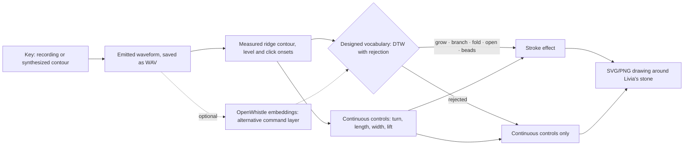

# Sound brush: a human-operated CHAT-style drawing loop

Implemented and measured **7 October 2026**. This is the first artifact proposed in
[idea 2](2026-art-ideas.md#2-dolphins-drawing-through-sound-and-a-human-keyboard-demo):
a keyboard plays recorded whistles or explicitly synthesized contours. The brush
analyzes the **emitted waveform** to draw around one of Livia's stones. It adapts the
[CHAT](chat-sound-interface.md) sequence of sound, then recognition, then consequence
to a drawing. A person plays it; it tests nothing about dolphins.

Run it with `uv run --group art --group viz main.py art brush study`, then open
`data/output/brush/index.html`. That page is generated locally and Git-ignored. The
pictures below link into it and appear after running the study.

## What CHAT establishes, and what it does not

| Evidence level | Source | What it establishes |
|---|---|---|
| Documented interface | [WDP: "CHAT: Is it a dolphin translator or an interface?"](https://www.wilddolphinproject.org/our-research/chat-research/) · [Georgia Tech 2024 article](https://www.cc.gatech.edu/news/video-illustrates-interactive-tech-created-help-understand-dolphin-communication) · [explainer video](https://www.youtube.com/watch?v=YhopeQKbpZA) · [Kohlsdorf et al., ISWC 2013, DOI 10.1145/2493988.2494346](https://doi.org/10.1145/2493988.2494346) | Designed whistles are paired with play objects. A wearable computer with hydrophones, speaker and keypad recognizes possible mimics and tells the diver which one it heard. |
| Prototype demonstration | [Dolphin CHAT Bot, Georgia Tech Spring 2025 capstone](https://expo.gatech.edu/prod1/portal/portal.jsp?c=17462&g=413665329&id=417265676&p=413142918) · [video](https://www.youtube.com/watch?v=kbzZdFaaAwk) | Whistles become thruster commands for an underwater vehicle. It is "demonstrated in controlled aquatic environments… with future plans for oceanic deployment and live dolphin trials." |
| Animal learning | [Herzing et al. 2024, *Animal Behavior and Cognition* 11(2):136–166, DOI 10.26451/abc.11.02.02.2024](https://doi.org/10.26451/abc.11.02.02.2024) | Across 2013–2016 field sessions, wild Atlantic spotted dolphins imitated CHAT's computer-generated whistles, immediately and with delay. They "did not show signs of a functional understanding of object labels." |
| Earlier keyboards | [Herzing 2016, DOI 10.12966/abc.04.11.2016](https://doi.org/10.12966/abc.04.11.2016) · [Reiss & McCowan 1993, PMID 8375147](https://pubmed.ncbi.nlm.nih.gov/8375147/) | Mimicry is not functional use. The 1993 aquarium keyboard study reports mimicry and some productive, context-appropriate use of the facsimiles by two males. |

CHAT recognition of a mimic does not establish that a dolphin understands or uses the
sound. A whistle-controlled machine has been prototyped, but learned animal control of
it has not been reported. [DolphinGemma's model page](https://deepmind.google/models/gemma/dolphingemma/)
still describes the model as "currently in development". On 7 October 2026 neither
Hugging Face nor Kaggle had a public checkpoint, so this prototype does not use it.


*Google's caption: CHAT Senior, 2012 (Herzing) and CHAT Junior, 2025 (Charles Ramey).
[Source](https://blog.google/innovation-and-ai/products/dolphingemma/).*

## The loop we built



The drawing reads **only the audio file**. Key events are saved for documentation but
are never passed to the analysis. This mirrors CHAT, which must recognize a sound
rather than be told which key was pressed. It also means a recording, a mimic or a
replay drives the brush exactly as a live key does.

### The keyboard

| Key | Plays | Designed command |
|---|---|---|
| C | Rising sweep, 7→14 kHz (one octave) | grow |
| D | Dip, 12 kHz down 0.7 octave and back | branch |
| E | Hump, 7.5 kHz up 0.7 octave and back | fold |
| F | Wavering tone, ±0.25 octave, two cycles | open |
| G | Click train, 14 clicks/s | beads |
| A | Falling sweep | not a command (should be rejected) |
| B | Steady tone | not a command (should be rejected) |
| C#, D#, F# | Recorded OpenWhistle bottlenose whistles 0000, 0001, 0002 | measured, never designed |
| G#, A# | Recorded DSWP sperm-whale codas 0000, 0001 | measured, never designed |

- **Hold** stretches a synthesized contour; it never extends a recording.
- **Velocity** sets peak level, from −36 to −6 dBFS.
- **Pitch bend** tilts a synthesized contour by up to ±0.5 octave, or changes a click train's rate.
- **Keyboard octave** moves the register by half an octave. Register is deliberately not mapped to the drawing: WDP reports that dolphins may reproduce a whistle in a shifted frequency range.
- **Recordings** are high-passed at 2 kHz and peak-normalized, then gain is applied. They are never pitch-shifted or time-stretched.

Phrases are typed (`C4:0.8@100~+0.5 rest:0.4 F4:1.0`), read from a MIDI file, or captured
live from a MIDI port.

### Measurement → recognition → consequence

| Stage | Exact rule (from [`resources/sound-brush.json`](../resources/sound-brush.json)) |
|---|---|
| Contour | STFT of 1024 samples with a 5 ms hop. The 3–20 kHz ridge peak uses parabolic interpolation. A frame is tonal when the peak exceeds the band median by ≥ 18 dB. Runs split at jumps over 0.2 octave and at level valleys of ≥ 12 dB, which separates legato notes. |
| Clicks | 2 kHz high-pass. Short-time energy (0.25 ms) must exceed the local 20 ms energy by ≥ 9 dB. Three or more clicks with gaps under 0.25 s form a click event. |
| Recognition | Each tonal contour is resampled to 48 points in semitones with its mean removed. It is compared by DTW (20% band) against the four designed templates. It is accepted when the nearest distance is ≤ 1.0 semitone, the margin to the second is ≥ 0.5, the sound lasts ≥ 0.12 s and it spans ≥ 1 semitone. |
| Turning | Heading changes by 90° per octave of measured pitch change, so a rise turns left. Branch pairs mirror the turn. |
| Length | 190 drawing units per second of sound. |
| Width | Ridge level, −42…−9 dBFS, maps to 4…26 units. |
| Lift | 0.25 s of silence lifts the brush. The next stroke starts on the stone's rim, a golden angle further around. |
| Effects | **grow** extends every tip. **branch** forks every tip into a diverging pair. **fold** draws a ribbon whose crease flips where the pitch turns (rising faces lit). **open** leaves a ring, half the stroke length across, scalloped by the waver. **beads** places one bead per click, spaced by the intervals. |

## Livia's vocabulary instead of a cage

The earlier [rib cocoon](../data/output/long-forms/controls.png) measured sound
faithfully but read as imprisonment. Here every stroke starts on the stone's rim and
leaves it, and the stone is drawn above the strokes so it stays exposed. Livia makes a
similar point about the Ice pendant: "the purpose of a jewelery is not only to cover
the stone but also to show it off."

| Effect | Livia's source ([`livia/content/pieces.md`](../../livia/content/pieces.md)) |
|---|---|
| branch | Mycelium: "a system to allow water to flow away… help from the mushrooms and fungi." Roots: "shows the difference that can be made from the algorithm." |
| fold | Mitoring's folded silver, read by Livistone as mitochondrial cristae |
| open | Nanot's open cells; Mycelium's drainage around porous opal |
| beads | The Brain ring's "growth… like algae spreading on the surface" |
| grow | An outward arm, like Amberear's ears, which also protect the stone |

These correspondences are our proposals. Livia has not authored or approved them.
The drawings are 2D concept plans, not wearable or fabrication-checked geometry.

## Results

### Every key, played alone

All seven synthesized keys behave as designed: rise→grow, dip→branch, hump→fold,
wave→open and clicks→beads. The falling sweep is rejected at 1.54 semitones from the
nearest template, and the steady tone is rejected as nearly flat. C3 and E5 give the
same commands as C4 and E4.

The recorded keys show what a real recording does to the brush. No natural whistle
fragment is recognized as a command. In the three OpenWhistle clips the brush measured:

| Clip | Measured | Recognition |
|---|---|---|
| openwhistle-0002 | A 0.48 s contour, 12.2→7.3 kHz | Nearest template "wave" at 1.18 semitones, so rejected |
| openwhistle-0000, openwhistle-0001 | Only fragments under 0.12 s | Too short for a command |

Their faint ridges draw thin, continuous-only lines. Impulsive sounds dominate these
recordings and become beads. The bead counts follow every transient, including
multipulse click components and background noise, so they are not coda-click counts.
That is a property of the recordings and the measurement, not an animal meaning.

### Performances


*Mitoring: grow, fold, open. The upper panel shows the keys only for reference. The
spectrogram is the analyzed audio, and each coloured contour has the same number as
its stroke.*

| Performance | Commands from the waveform | Drawing |
|---|---|---|
| `mitoring-folds` | grow, fold, grow · grow, fold · open, grow | 2 lifts, 418 units of folded ribbon, 1 opening |
| `mycelium-channels` | grow, branch, grow, branch, open · beads, grow, branch, grow, open | Up to 4 channels, 6 drainage openings, 12 beads |
| `recorded-whistles` | beads plus rejected fragments for each recording | 92 beads, 171 units of thin continuous line |


*Mycelium: bending the rising notes down halves their turning, so the channels spread
instead of knotting. Every tip then opens a drainage hole.*

### One acoustic change at a time

There is no random seed, and every pair differs in one performed feature.

| Change | Designed effect | Measured |
|---|---|---|
| Bend +1 on a rising sweep | +45° of turning | Turn 89° → 133°; length unchanged (173 units) |
| Hold 0.6 → 1.2 s | Twice the length, same turn | 117 → 231 units; turn 88° → 89° |
| Velocity 50 → 120 | Wider stroke | Mean width 14.6 → 25.2 units |
| Key E → F | Different command | fold → open |
| Legato → rest | Brush lifts | 0 → 1 lift; the branch moves from 90° to 227.5° on the rim |
| Octave C4/E4 → C5/E5 | No change by design | Same commands, path length 325 units in both; width 22.2 vs 21.6, because ridge-level estimates vary slightly with frequency |


### Replay

For all three performances, four routes gave the same stroke hash:

1. The original performance run.
2. The saved WAV copied under an anonymous name, with no key data nearby.
3. A fresh process running `art brush draw`.
4. A re-render of the phrase from its key events, which also reproduced the same audio bytes.

As a control, playing the first note one velocity step quieter changed the stroke hash
in all three performances, with mean width changes of 0.07–0.16 units. The unit test
`test_identical_audio_reproduces_the_identical_stroke_without_key_data` checks the same
property.

### The 2026 dolphin encoder as a second layer

[OpenWhistle Wav2Vec2](https://huggingface.co/dolphinteam/OpenWhistle-Wav2Vec2.0) was
pinned at revision `985ac11`; its weights were committed in `1b92224` on 4 May 2026
([paper, arXiv:2609.34839](https://arxiv.org/abs/2609.34839)).

- **What it is:** a frozen encoder. It is not a classifier and not a generator. It loads into `Wav2Vec2Model` with no missing weights; only the pretraining quantizer heads are unused.
- **Training data:** five bottlenose dolphins recorded at Dolphin Reef, Eilat. These are not WDP's spotted dolphins, and not synthetic whistles.
- **License:** not specified on the model card.

We enrolled 36 labelled synthetic examples, nine per command, and assigned each sound
to the nearest class centroid. Layer and pooling were chosen by leave-one-out accuracy
on the enrollment set alone:

- Time-averaged embeddings were at chance (28–33% for four classes). Averaging loses order, and a rise contains the same frequencies as a fall.
- Four time chunks with the clip mean removed did best: layer 9, 61%.

Both layers then saw the same 109 held-out items:

| Condition | Contour + DTW: commands | Contour: non-commands accepted | OpenWhistle: commands | OpenWhistle: non-commands accepted |
|---|---|---|---|---|
| Clean | 16/16 | 0/8 | 13/16 | 6/8 |
| Transposed ±0.25/±0.75 oct | 16/16 | 0/8 | 9/16 | 6/8 |
| Bend ±0.5 | 8/8 | 1/4 | 6/8 | 4/4 |
| Real pool noise, 20/10/0 dB SNR | 24/24 | 0/12 | 13/24 | 12/12 |
| Natural whistles (13) | — | 2/13 | — | 10/13 |


For a small designed vocabulary, the measured contour layer is more accurate, more
robust to transposition and noise, and explainable in semitones. The frozen encoder
with nearest centroids neither recognizes the commands reliably nor rejects unrelated
sounds. Its threshold was calibrated without negative examples.

The PCA still separates natural whistles from the synthetic contours, so the encoder
does represent the domain difference. Possible improvements are a trained head, real
mimics as enrollment, or explicit negatives. The contour layer has its own weakness:
all three of its false accepts were "open" at 0.87–0.91 semitones, because the wave
template has the smallest extent. The thresholds were fixed before testing and were
not retuned.

On the performances the two layers agreed on 7/7 tonal events for Mitoring, 6/9 for
Mycelium and 8/8 for the recordings. For the recordings, both layers rejected every
whistle. The gallery shows each learned-layer drawing beside the contour drawing.

### Latency

The loop is phrase-level, like a CHAT detection window. Nothing is drawn while a key
is held.

- **Offline, per phrase:** measuring takes 62–194 ms, recognition 64–77 ms (pure-Python DTW) and drawing 1–3 ms. SVG, PNG and the explanatory figure add 0.55–1.2 s.
- **Live MIDI:** a scripted sender drove a virtual port, so this was not a human performer. After warm-up the drawing was saved 300–515 ms after a 0.8 s silence ended the phrase.

No physical MIDI keyboard was connected in this session.

## Commands

```bash
uv run --group art --group viz main.py art brush keys                      # keyboard map
uv run --group art --group viz main.py art brush play "C4:0.8@100 E4:1.0 rest:0.4 F4:0.9"
uv run --group art --group viz --group midi main.py art brush play --midi phrase.mid
uv run --group art --group viz main.py art brush draw data/output/brush/performances/mitoring-folds.wav
uv run --group art --group viz main.py art brush study                     # everything + gallery
uv run --group art --group viz --group midi main.py art brush live --list-ports
uv run --group art --group viz --group midi main.py art brush live --port "<name>" --phrases 5 --play
```

The study needs the six clips from `art fetch` and the long recording from
`art long-forms`, which supplies real pool noise. It runs in about 40 s, including the
OpenWhistle comparison on the GPU.

## Limits and next steps

1. **A human session.** Play with a physical MIDI keyboard and record which effects a performer can produce deliberately. The live sessions log stores each phrase, its hashes and its latency.
2. **Continuous live drawing.** This needs contour families defined in absolute time and a streaming synthesizer. The current families stretch to the hold, which is only known at release.
3. **A concept render.** Pass the stroke as a second FLUX.2 klein reference beside the Livia photograph. Swap guides while keeping the seed and prompt fixed, to show whether the drawn sound survives the image model. This was not run here because the GPU was occupied by other jobs.
4. **Recognition.** Tighten the small-extent wave template, for example with an extent-ratio check. Test a trained head or negative enrollment for OpenWhistle.
5. **Artist review.** Ask Livia whether grow/branch/fold/open are the right effects. Ask whether a 2D plan should become a relief, a setting surface or a 3D mesh.
6. **Animal work** would be a separate study with a research partner. It would need perceivable feedback, contingent versus yoked controls and evidence beyond mimicry ([evidence list](chat-sound-interface.md#evidence-needed-for-a-dolphin-operated-version)).
